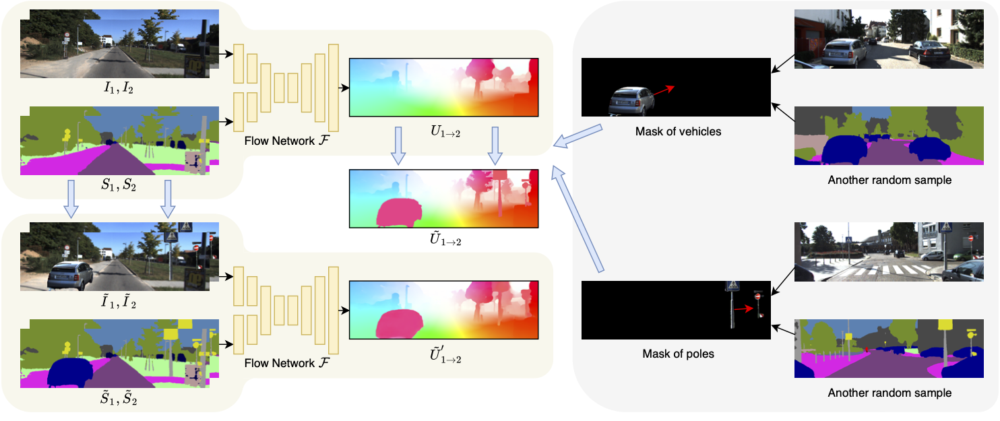

# SemARFlow: Injecting Semantics into Unsupervised Optical Flow Estimation for Autonomous Driving

  

This repository contains the PyTorch implementation of our paper titled [**SemARFlow: Injecting Semantics into Unsupervised Optical Flow Estimation for Autonomous Driving**](https://arxiv.org/pdf/2303.06209), to be presented on ICCV-2023. A detailed diagram of our network structure can be found in the appendix.



## Requirements

### Environment

This code has been tested under Python 3.6.9, PyTorch 1.1.0, Torchvision 0.3.0, and CUDA 10.0 on Ubuntu 18.04. The environment can be built by the following:

```shell
# Install python packages
pip3 install -r requirements.txt

# Compile the coorelation package
cd ./models/correlation_package
python3 setup.py install

```

If you cannot compile the correlation package, please check whether you have stated the correct gcc and CUDA version in [`models/correlation_package/setup.py`](./models/correlation_package/setup.py). From our experience, this correlation package only works for CUDA 9.0-10.0 with Torch 1.1.0 and Torchvision 0.3.0. Any higher versions may not be compatible. There is also an alternative implementation (See [`models/pwclite.py`](./models/pwclite.py#L7), Line 7; uncomment to switch implementations).

### Datasets

- **KITTI**: The following sets are required.
    - **KITTI-raw**: Follow the instructions on [KITTI raw data page](https://www.cvlibs.net/datasets/kitti/raw_data.php) to download.
    - **KITTI-2015** Go to [KITTI flow 2015 page](https://www.cvlibs.net/datasets/kitti/eval_scene_flow.php?benchmark=flow). Download **"stereo 2015/flow 2015/scene flow 2015 data set (2 GB)"** and **"multi-view extension (20 frames per scene) (14 GB)"**. Extract zip files under the same folder.
    - **KITTI-2012** Go to [KITTI flow 2012 page](https://www.cvlibs.net/datasets/kitti/eval_stereo_flow.php?benchmark=flow). Download **"stereo/optical flow data set (2 GB)"** and **"multi-view extension (20 frames per scene, all cameras) (17 GB)"**. Extract zip files under the same folder.
    
- **Cityscapes**: Go to [Cityscapes official website](https://www.cityscapes-dataset.com/downloads/). Download **"leftImg8bit_sequence_trainvaltest.zip (324GB)"**.

### Semantic inputs

We use an [off-the-shelf network](https://openaccess.thecvf.com/content_CVPR_2019/papers/Zhu_Improving_Semantic_Segmentation_via_Video_Propagation_and_Label_Relaxation_CVPR_2019_paper.pdf) by Yi Zhu *et al.* to infer semantic segmentation inputs for our experiments. Their official code is [here](https://github.com/NVIDIA/semantic-segmentation/tree/sdcnet). Please follow their instructions to infer semantic maps. For all KITTI images, we use their **"pretrained_models/kitti_best.pth[1071MB, WideResNet38 backbone]"** model; for Cityscapes images, we use their **"pretrained_models/cityscapes_best.pth[1071MB, WideResNet38 backbone]"** model. The output semantic maps should have the same directory structure and file names as in KITTI or Cityscapes.


## Pre-trained models

We include our trained models (the same as those shown in Table 1 in the paper) under `pretrained_models` listed below. Each experiment has a folder that contains both a model weight file (`model_ckpt.pth.tar`) and model configuration files (`config.json` and `kitti_base.json`). See the [How to test or do inference](#how-to-test-or-do-inference) section below for instructions.

- `pretrained_models/ours_baseline` [10MB]: Our adapted ARFlow with added learned upsampler and no smoothness loss
- `pretrained_models/ours_baseline+enc` [10MB]: Our adapted ARFlow with added learned upsampler, no smoothness loss, and semantic encoder
- `pretrained_models/ours_baseline+enc+aug` [10MB, **our final model**]: Our adapted ARFlow with added learned upsampler, no smoothness loss, semantic encoder, and semantic augmentation


## How to train

Commands for training are included in [train.sh](./train.sh). To train, simply run

```shell
python3 train.py -c configs/YOUR_CONFIG.json --n_gpu=N_GPU --exp_folder EXP_FOLDER --name=EXP_NAME [--model=MODEL_PATH] [--DEBUG]
```

> Arguments:
> - `-c configs/YOUR_CONFIG.json`:  the configuration file you want to use. We have kept all our configuration files under the `configs` folder. We use two-level configuration. Files such as [`configs/kitti_base.json`](./configs/kitti_base.json) define the most basic configurations that are shared by all other experiments. Apart from that, files like [`configs/kitti_baseline+enc+aug.json`](./configs/kitti_baseline+enc+aug.json) define the specific configuration of each experiment, where they refer to the shared json file to include basic configurations.
> - `--n_gpu=N_GPU`: the number of GPUs (overwritting the configuration).
> - `--exp_folder=EXP_FOLDER`: the parent folder to save results.
> - `--name=EXP_NAME`: name of this experiment, used to create result folder.
> - `--model=MODEL_PATH`: the path of the pre-trained model. Leave blank to train from scratch.
> - `--DEBUG`: run the experiment in DEBUG model (fewer iterations, adding DEBUG prefix to folder names, etc.)

Before training, **please specify your data folder paths** in the configuration files. Specifically, update your data folder paths in [configs/kitti_base.json, Line 19-24](./configs/kitti_base.json#L19-24) and [configs/cityscapes_base.json, Line 18-23](./configs/cityscapes_base.json#18-23). All results of this experiment will be saved automatically under `results/EXP_FOLDER/yyyymmdd_hhmmss_EXP_NAME/`, where `yyyymmdd_hhmmss` is the time stamp when you start the experiment. You may change this setting at [train.py, Line 116-119](./train.py#L116). A log file `yyyymmdd_hhmmss.log` and a tensorboard file `events.out.tfevents.*` will be saved under this folder. The configuration files used will also be automatically copied to this experiment folder.

If your experiment is interrupted and stops running, we do save model checkpoint (as well as the states of the optimizer and the learning rate scheduler) every 1k iterations at `model_ckpt.pth.tar` under the experiment folder. To resume training, run

```shell
python3 train.py --resume results/EXP_FOLDER/yyyymmdd_hhmmss_EXP_NAME --n_gpu=N_GPU
```
It will start from where it was, and save everything in the same folder as before, just as if it never stopped!

### To reproduce Table 1 in the paper (Benchmark test)
- `Ours (baseline)`: 

```shell
python3 train.py -c configs/kitti_baseline.json --n_gpu=2 --exp_folder iccv2023 --name ours_baseline
```

- `Ours (+enc)`: 

```shell
python3 train.py -c configs/kitti_baseline+enc.json --n_gpu=2 --exp_folder iccv2023 --name ours_enc
```

- `Ours (+enc +aug)`: 

```shell
python3 train.py -c configs/kitti_baseline+enc+aug.json --n_gpu=2 --exp_folder iccv2023 --name ours_final
```

### To reproduce Table 2 in the paper (Benchmark test)

`Ours (final)`: same as the `Ours (+enc +aug)` above

```shell
python3 train.py -c configs/kitti_baseline+enc+aug.json --n_gpu=2 --exp_folder iccv2023 --name ours_final
```

### To reproduce Table 3 in the paper (Ablation study)

Each line of code below represents one row in the table, respectively.

```shell
python3 train.py -c configs/kitti_base.json --n_gpu=2 --exp_folder iccv2023 --name ours_no_change
# ----------
python3 train.py -c configs/kitti_enc1.json --n_gpu=2 --exp_folder iccv2023 --name ours_enc1
python3 train.py -c configs/kitti_enc2.json --n_gpu=2 --exp_folder iccv2023 --name ours_enc2
python3 train.py -c configs/kitti_enc3.json --n_gpu=2 --exp_folder iccv2023 --name ours_enc3
python3 train.py -c configs/kitti_enc4.json --n_gpu=2 --exp_folder iccv2023 --name ours_enc4
# ----------
python3 train.py -c configs/kitti_up_only.json --n_gpu=2 --exp_folder iccv2023 --name ours_up_only
python3 train.py -c configs/kitti_baseline.json --n_gpu=2 --exp_folder iccv2023 --name ours_baseline
# ----------
python3 train.py -c configs/kitti_baseline+enc.json --n_gpu=2 --exp_folder iccv2023 --name ours_enc
python3 train.py -c configs/kitti_baseline+aug.json --n_gpu=2 --exp_folder iccv2023 --name ours_aug
python3 train.py -c configs/kitti_baseline+enc+aug.json --n_gpu=2 --exp_folder iccv2023 --name ours_final
```

### To reproduce Table 4 in the paper (Ablation study on different aug options)

`Ours (final)` is the same as above. The other rows of the table are from

```shell
python3 train.py -c configs/kitti_ablate_aug1.json --n_gpu=2 --exp_folder iccv2023 --name ours_aug_start100k
python3 train.py -c configs/kitti_ablate_aug2.json --n_gpu=2 --exp_folder iccv2023 --name ours_aug_vehicles_only
python3 train.py -c configs/kitti_ablate_aug3.json --n_gpu=2 --exp_folder iccv2023 --name ours_aug_focus_new_occ
```


### To reproduce Table 6 in the paper (Generalization ability)

Each line of code below represents one row in the table, respectively.

```shell
python3 train.py -c configs/cityscapes_base.json --n_gpu=2 --exp_folder iccv2023 --name ours_city_no_change
python3 train.py -c configs/cityscapes_baseline.json --n_gpu=2 --exp_folder iccv2023 --name ours_city_baseline
python3 train.py -c configs/cityscapes_baseline+enc.json --n_gpu=2 --exp_folder iccv2023 --name ours_city_enc
python3 train.py -c configs/cityscapes_baseline+enc+aug.json --n_gpu=2 --exp_folder iccv2023 --name ours_city_final
```


## How to test or do inference

Commands for testing are included in [test.sh](./test.sh). Specifically, we run

```shell
python3 test.py --model-folder=pretrained_models/ours_baseline+enc+aug --trained-model=model_ckpt.pth.tar --set=testing
```
> Before doing inference, **please specify your data folder paths** in [test.py, Line 99-102](./test.py#L99). You can also change the `--set` argument to "training" to do inferernce on the training set.

The inference output will be saved under `pretrained_models/ours_baseline+enc+aug/testing_flow_kitti` (or `training_flow_kitti`) by default unless you specify the `--output-dir` argument.

## Code credits

 - The overall structure of this code is adapted from the official [ARFlow github repo](https://github.com/lliuz/ARFlow) of Liang Liu *et al.*, appeared in their publication [Learning by Analogy: Reliable Supervision from Transformations for Unsupervised Optical Flow Estimation](https://openaccess.thecvf.com/content_CVPR_2020/papers/Liu_Learning_by_Analogy_Reliable_Supervision_From_Transformations_for_Unsupervised_Optical_CVPR_2020_paper.pdf).

 - Some of the functions are borrowed from the official [RAFT github repo](https://github.com/princeton-vl/RAFT) of Zachary Teed and Jia Deng, appeared in their publication [RAFT: Recurrent All Pairs Field Transforms for Optical Flow](https://www.ecva.net/papers/eccv_2020/papers_ECCV/papers/123470392.pdf).

 - Our semantic segmentation inputs are computed using this official [github repo](https://github.com/NVIDIA/semantic-segmentation/tree/sdcnet) of Yi Zhu *et al.*, appeared in their publication [Improving Semantic Segmentation via Video Propagation and Label Relaxation](https://openaccess.thecvf.com/content_CVPR_2019/papers/Zhu_Improving_Semantic_Segmentation_via_Video_Propagation_and_Label_Relaxation_CVPR_2019_paper.pdf)
